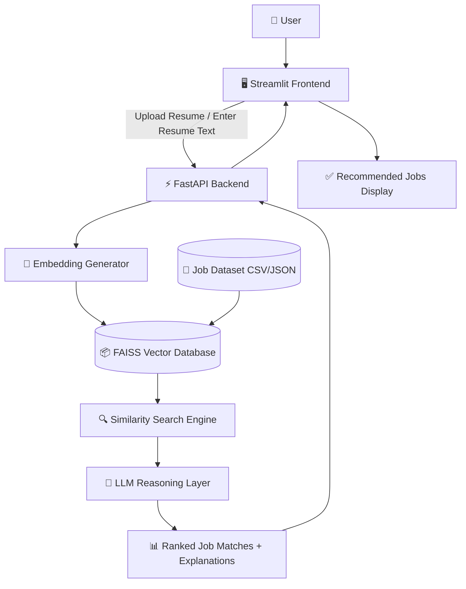
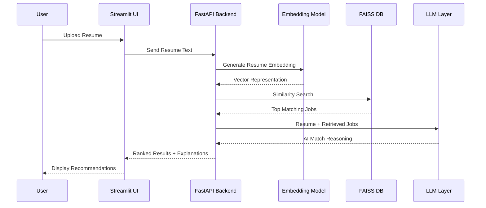
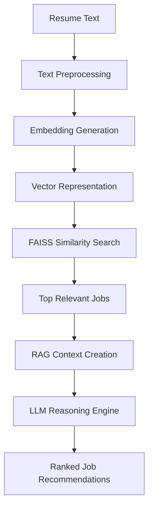
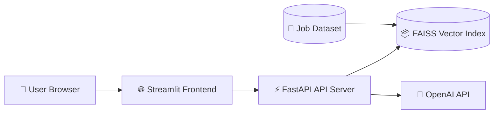

<p align="center">
  
</p>
---
# 🚀 AI Job Matching Agent (RAG + LLM + FastAPI)

An end-to-end AI-powered job matching system that intelligently connects resumes with relevant job opportunities using semantic search, vector databases, Retrieval-Augmented Generation (RAG), and LLM-based reasoning — inspired by modern AI recruitment platforms like Jobright .ai.

---

# 🎯 Problem Statement

Traditional job portals rely heavily on keyword matching, often producing inaccurate or irrelevant recommendations.

This project demonstrates how AI can improve hiring by:

- Understanding resumes semantically
- Matching candidates with relevant jobs intelligently
- Explaining *why* a role is a good fit
- Creating scalable AI recruitment workflows

---

# ⚡ Key Features

✅ Resume → Embedding pipeline  
✅ Semantic job matching using FAISS  
✅ Retrieval-Augmented Generation (RAG) workflow  
✅ LLM-powered reasoning engine  
✅ FastAPI production-style backend  
✅ Streamlit interactive frontend  
✅ Modular and scalable architecture  
✅ Explainable AI recommendations  

---

# 🧠 System Architecture



---

# 🔧 Component Overview

| Component | Description |
|---|---|
| Streamlit Frontend | User interface for uploading resumes and viewing job recommendations |
| FastAPI Backend | Handles APIs, embedding generation, and AI workflows |
| Embedding Generator | Converts resumes and jobs into semantic vectors |
| FAISS Vector DB | Stores embeddings for high-speed similarity search |
| Job Dataset | Collection of job descriptions used for retrieval |
| Similarity Search Engine | Finds semantically relevant jobs |
| LLM Reasoning Layer | Explains why the candidate matches the role |

---

# 🔄 End-to-End Workflow



---

# 🧠 AI Workflow



---

# 🧩 Tech Stack

| Technology | Purpose |
|---|---|
| Python | Core programming language |
| FastAPI | Backend API framework |
| Streamlit | Frontend interface |
| Sentence Transformers | Embedding generation |
| FAISS | Vector similarity search |
| OpenAI API | LLM reasoning |
| Pandas / NumPy | Data processing |

---

# 📊 Example Output

### 📥 Input Resume

> Python developer with machine learning experience, API development skills, and knowledge of AI workflows.

---

### 📤 AI Response

#### 🧑‍💼 Job Match: AI Engineer

**Why This Role Fits**
- Strong alignment with Python and Machine Learning experience
- Backend API knowledge matches AI infrastructure requirements
- Familiarity with AI workflows improves role compatibility

---

# 📁 Project Structure

```bash
jobright/
│
├── backend/
│   ├── main.py
│   ├── embeddings.py
│   ├── faiss_index.py
│   ├── rag_pipeline.py
│   ├── llm_reasoning.py
│   ├── requirements.txt
│   │
│   └── jobs/
│       └── jobs.json
│
├── ui/
│   ├── streamlit_app.py
│   └── requirements.txt
│
├── README.md
├── .gitignore
├── docker-compose.yml
└── requirements.txt
```

---

# 🚀 Deployment Architecture



---

# 🛠️ Setup Instructions

## 1️⃣ Clone Repository

```bash
git clone https://github.com/YOUR_USERNAME/jobright.git

cd jobright
```

---

## 2️⃣ Create Virtual Environment

### Windows

```bash
python -m venv venv

venv\Scripts\activate
```

### Mac/Linux

```bash
python3 -m venv venv

source venv/bin/activate
```

---

## 3️⃣ Install Dependencies

```bash
pip install -r requirements.txt
```

---

# ▶️ Run The Project

## Start FastAPI Backend

```bash
uvicorn app.main:app --reload
```

Backend URL:

```bash
http://127.0.0.1:8000
```

---

## Start Streamlit Frontend

Open another terminal:

```bash
streamlit run ui/streamlit_app.py
```

Frontend URL:

```bash
http://localhost:8501
```

---

# 🔍 How The System Works

1. User submits resume text
2. Resume is converted into semantic embeddings
3. FAISS retrieves top similar jobs
4. RAG pipeline prepares contextual information
5. LLM generates intelligent reasoning
6. API returns ranked recommendations

---

# 📌 Current Project Status

| Feature | Status |
|---|---|
| FastAPI Backend | ✅ Completed |
| Streamlit Frontend | ✅ Completed |
| Embedding Pipeline | ✅ Completed |
| FAISS Search | ✅ Completed |
| Localhost Testing | ✅ Completed |
| Cloud Deployment | ❌ Pending |
| Docker Deployment | ❌ Pending |

---

# 🔐 Future Improvements

- ✅ User Authentication
- ✅ Resume PDF Parsing
- ✅ Real-Time Job APIs
- ✅ Docker + Kubernetes
- ✅ Pinecone Vector DB
- ✅ Cloud Deployment (GCP/AWS)
- ✅ Skill Gap Analysis
- ✅ Resume Optimization Suggestions
- ✅ Multi-Agent AI Workflow
- ✅ Job Trend Analytics

---

# 🌟 Future Vision

This project can evolve into a complete AI recruitment ecosystem featuring:

- AI Recruiter Agents
- Personalized Career Recommendations
- Real-Time Hiring Intelligence
- Autonomous Resume Optimization
- Enterprise Hiring Dashboards

---

# 📜 License

This project is developed for educational, research, and portfolio purposes.

---

# 👨‍💻 Author

Developed by **Vamsi Kamtam**  
AI + Full Stack + RAG Systems Enthusiast
